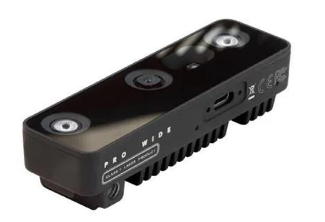
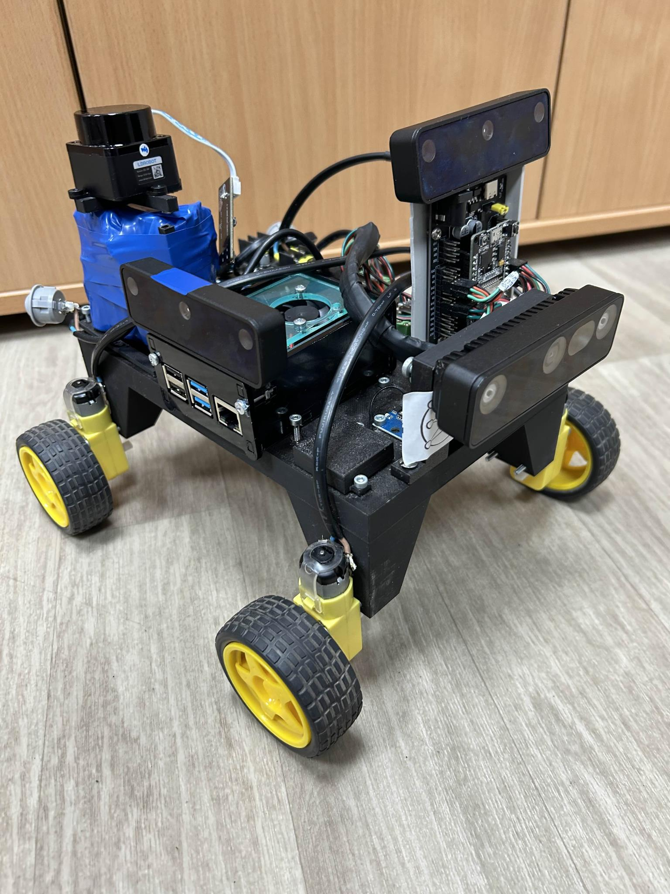

# Trailblazer Cloud - Dokumentacja paczki z RTAB-Map

Paczka `trailblazer_cloud` w projekcie TrailblazerML integruje kamerę OAK-D z RTAB-Map, umożliwiając mapowanie 3D, lokalizację robota (SLAM) i detekcję przeszkód. Poniżej znajdziesz szczegółowy opis węzłów RTAB-Map użytych w plikach `depthai.launch.py`, `stereo_inertial_node.launch.py` oraz `stereo_inertial_publisher.cpp`, wraz z danymi wejściowymi i wyjściowymi.

## 📚 Spis treści

- [📄 Ogólny opis](#-ogólny-opis)
- [🛠️ Węzły RTAB-Map](#️-węzły-rtab-map)
  - [1️⃣ rgbd_sync](#1️⃣-rgbd_sync)
  - [2️⃣ imu_filter_madgwick](#2️⃣-imu_filter_madgwick)
  - [3️⃣ rgbd_odometry](#3️⃣-rgbd_odometry)
  - [4️⃣ rtabmap](#4️⃣-rtabmap)
  - [5️⃣ point_cloud_xyz](#5️⃣-point_cloud_xyz)
  - [6️⃣ obstacles_detection](#6️⃣-obstacles_detection)
- [📁 Struktura katalogów](#-struktura-katalogów)
- [⚙️ Używany sprzęt](#️-używany-sprzęt)
- [🛠️ Jak używać](#️-jak-używać)

## 📄 Ogólny opis

Paczka `trailblazer_cloud` przetwarza dane z kamery OAK-D (RGB, głębia, IMU) i integruje je z RTAB-Map, umożliwiając SLAM w 2D z wymuszoną orientacją 3DoF (`Reg/Force3DoF: true`). Wykorzystuje `stereo_inertial_node` do publikacji danych surowych, które następnie są synchronizowane i przetwarzane przez RTAB-Map w celu tworzenia mapy, lokalizacji robota i wykrywania przeszkód.

---

## 🛠️ Węzły RTAB-Map

### 1️⃣ rgbd_sync

**Opis**: Węzeł z pakietu `rtabmap_sync` synchronizuje obrazy RGB, dane głębi i informacje o kamerze, aby stworzyć spójny strumień danych RGB-D.

- **Dane wejściowe**:
  - `/color/image` (RGB) lub `/right/image_rect` (mono, w zależności od `depth_aligned`): `sensor_msgs/msg/Image`
  - `/color/camera_info` lub `/right/camera_info`: `sensor_msgs/msg/CameraInfo`
  - `/stereo/depth`: `sensor_msgs/msg/Image` (dane głębi)

- **Dane wyjściowe**:
  - `/rgbd_image`: `rtabmap_msgs/msg/RGBDImage` (zsynchronizowane dane RGB-D)

- **Warunek uruchomienia**:
  - Działa w dwóch trybach w zależności od parametru `depth_aligned`:
    - Jeśli `true`: synchronizuje z `/color/image` (RGB).
    - Jeśli `false`: synchronizuje z `/right/image_rect` (mono).

---

### 2️⃣ imu_filter_madgwick

**Opis**: Węzeł z pakietu `imu_filter_madgwick` przetwarza surowe dane IMU (akcelerometr, żyroskop, magnetometr) i oblicza orientację w formie kwaternionów.

- **Dane wejściowe**:
  - `/oak/imu` (domyślnie, `name` + `/imu`): `sensor_msgs/msg/Imu` (surowe dane IMU)
  - `/oak/magnetic_field` (domyślnie, `name` + `/magnetic_field`): `sensor_msgs/msg/MagneticField` (dane magnetometru)

- **Dane wyjściowe**:
  - `/imu/data`: `sensor_msgs/msg/Imu` (przetworzone dane IMU z kwaternionami)

- **Parametry**:
  - `use_mag: true` – uwzględnia magnetometr.
  - `world_frame: enu` – system współrzędnych.
  - `publish_tf: false` – nie publikuje transformacji TF.

---

### 3️⃣ rgbd_odometry

**Opis**: Węzeł z pakietu `rtabmap_odom` oblicza wizualną odometrię na podstawie danych RGB-D.

- **Dane wejściowe**:
  - `/rgbd_image`: `rtabmap_msgs/msg/RGBDImage` (zsynchronizowane dane RGB-D)
  - `/imu/data`: `sensor_msgs/msg/Imu` (dane IMU)

- **Dane wyjściowe**:
  - `/odom`: `nav_msgs/msg/Odometry` (odometria wizualna)
  - Publikuje transformację TF z `guess_frame_id: vo` do `odom`.

- **Parametry**:
  - `frame_id: base_link` – ramka odniesienia.
  - `publish_tf: true` – publikuje TF.
  - `Vis/MaxFeatures: 3000` – liczba cech do ekstrakcji.
  - `GFTT/MinDistance: 7` – minimalna odległość między cechami.

---

### 4️⃣ rtabmap

**Opis**: Główny węzeł z pakietu `rtabmap_slam`, realizujący SLAM (Simultaneous Localization and Mapping).

- **Dane wejściowe**:
  - `/rgbd_image`: `rtabmap_msgs/msg/RGBDImage` (dane RGB-D)
  - `/imu/data`: `sensor_msgs/msg/Imu` (dane IMU)

- **Dane wyjściowe**:
  - `/rtabmap/map`: `nav_msgs/msg/OccupancyGrid` (mapa 2D)
  - `/rtabmap/odom`: `nav_msgs/msg/Odometry` (odometria)
  - Transformacje TF (np. `map` -> `odom` -> `base_link`)

- **Parametry**:
  - `Reg/Force3DoF: true` – wymusza orientację 2D.
  - `Grid/3D: false` – mapa 2D.
  - `Grid/MaxGroundHeight: 0.05` – punkty powyżej 5 cm to przeszkody.
  - `Grid/MaxObstacleHeight: 0.4` – ignoruje punkty powyżej 40 cm.
  - `Optimizer/GravitySigma: 0` – wyłącza ograniczenia IMU.

---

### 5️⃣ point_cloud_xyz

**Opis**: Węzeł z pakietu `rtabmap_util` generuje chmurę punktów XYZ na podstawie danych głębi.

- **Dane wejściowe**:
  - `/stereo/depth`: `sensor_msgs/msg/Image` (dane głębi)
  - `/stereo/camera_info`: `sensor_msgs/msg/CameraInfo` (informacje o kamerze)

- **Dane wyjściowe**:
  - `/camera/cloud`: `sensor_msgs/msg/PointCloud2` (chmura punktów XYZ)

- **Parametry**:
  - `decimation: 2` – zmniejsza gęstość chmury.
  - `max_depth: 3.0` – maksymalna odległość 3 m.
  - `voxel_size: 0.02` – rozmiar voksela 2 cm.

---

### 6️⃣ obstacles_detection

**Opis**: Węzeł z pakietu `rtabmap_util` wykrywa przeszkody i grunt na podstawie chmury punktów.

- **Dane wejściowe**:
  - `/camera/cloud`: `sensor_msgs/msg/PointCloud2` (chmura punktów XYZ)

- **Dane wyjściowe**:
  - `/camera/obstacles`: `sensor_msgs/msg/PointCloud2` (przeszkody)
  - `/camera/ground`: `sensor_msgs/msg/PointCloud2` (grunt)

- **Parametry**:
  - `Grid/NormalsSegmentation: false` – używa filtru passthrough.
  - `Grid/NoiseFilteringMinNeighbors: 5` – minimalna liczba sąsiadów do filtrowania szumów.
  - `Grid/MinClusterSize: 20` – minimalny rozmiar klastra punktów.

---

## 📁 Struktura katalogów

    src/trailblazer_cloud
    ├── launch              # Pliki startowe (np. depthai.launch.py, stereo_inertial_node.launch.py)
    ├── src                 # Kod źródłowy (np. stereo_inertial_publisher.cpp)
    ├── rviz                # Konfiguracje RViz (np. stereoInertialDepthAlignROS2.rviz)
    ├── resources           # Modele NN dla detekcji
    ├── package.xml         # Zależności, opis, wersja
    └── setup.py            # Plik instalacyjny

---

## ⚙️ Używany sprzęt

- Kamera OAK-D (np. OAK-D-PRO-W)
- Komputer z ROS 2 Humble i pakietem `depthai-ros`

<div align="center">
    
    
</div>

---

## 🛠️ Jak używać

### ✅ Zbudowanie paczki

```bash
cd ~/TrailblazerML
colcon build --packages-select trailblazer_cloud
source install/setup.bash
```

### 🚀 Uruchomienie węzłów

- Uruchomienie z RTAB-Map:
  ```bash
  ros2 launch trailblazer_cloud depthai.launch.py camera_model:=OAK-D
  ```

- Uruchomienie samego węzła kamery:
  ```bash
  ros2 run trailblazer_cloud stereo_inertial_node
  ```

### 🧩 Integracja z innymi paczkami

```python
from launch_ros.actions import Node

# Węzeł kamery
camera_node = Node(
    package='trailblazer_cloud',
    executable='stereo_inertial_node',
    name='oak_camera',
    parameters=[{'depth_aligned': True, 'monoResolution': '720p'}]
)

# Węzeł RTAB-Map
rtabmap_node = Node(
    package='rtabmap_slam',
    executable='rtabmap',
    name='rtabmap_node',
    parameters=[{'frame_id': 'base_link', 'Reg/Force3DoF': 'true'}]
)
```

---
