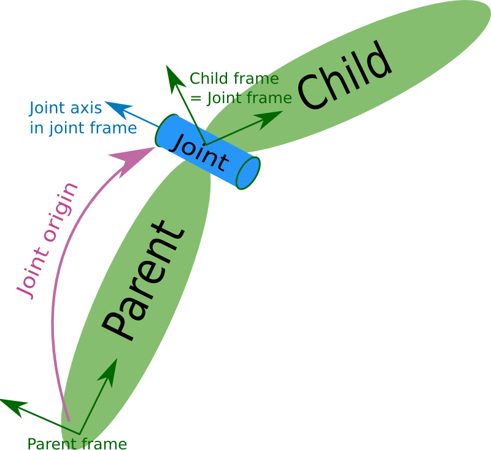
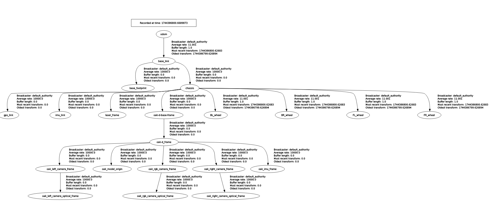

# Trailblazer Description

Paczka ROS 2 ***trailblazer_description*** zawiera pełny opis modelu łazika marsjańskiego [Legendary LRT 2.2 “Wolverine”](https://legendary.prz.edu.pl/?page_id=469).

Paczka została przygotowana z myślą o ROS 2 Humble i wykorzystuje formaty URDF oraz XACRO do modularnego opisu robota.

## 📚 Spis treści

- [📁 Struktura katalogów](#-struktura-katalogów)
- [🤖 Czym są URDF i XACRO?](#-czym-są-urdf-i-xacro)
- [📦 Zawartość URDF/XACRO](#-zawartość-urdfxacro)
- [🛠️ Jak używać](#️-jak-używać)
- [🧪 Testy](#-testy)


## 📁 Struktura katalogów
    src/trailblazer_description
    ├── config/                      # Pliki konfiguracyjne
    ├── launch/                      # Pliki startowe
    ├── meshes/                      # Pliki STL
    ├── package.xml                  # Zależności, opis, wersja
    ├── setup.py                     # Plik instalacyjny
    ├── test/                        # Testy
    ├── trailblazer_description/     # Moduł paczki
    └── urdf/                        # Pliki URDF/XACRO

## 🤖 Czym są URDF i XACRO?
### ***URDF*** (Unified Robotic Description Format) 
URDF to format pliku XML używany w ROS do opisu budowy robota. Definiuje on strukturę kinematyczną, właściwości fizyczne, kolizje oraz wizualizację robota. Podstawowe elementy URDF:
- Link – reprezentuje sztywną część robota, np. ramię, bazę, koło.
- Joint – definiuje sposób, w jaki dwa linki są połączone i jak mogą się względem siebie poruszać (np. obroty, przesunięcia).

Każda część robota, która się porusza niezależnie, powinna być osobnym `link`, a ich relacje określamy poprzez `joint`.

<div align="center">
  
</div>

### ***XACRO*** - XML Macros
XACRO to rozszerzenie URDF, które pozwala pisać bardziej modularne i elastyczne opisy robota. Dzięki XACRO możemy:
- używać parametrów (np. rozmiar, nazwa, kolory),
- tworzyć makra – wielokrotnego użytku fragmenty URDF (np. koło, sensor),
- importować inne pliki, co umożliwia podział projektu na mniejsze części.

Dzięki temu robot zbudowany z wielu identycznych elementów (np. cztery koła) może być opisany raz, a potem tylko powielony z różnymi parametrami.

## 📦 Zawartość URDF/XACRO
Pliki w katalogu urdf są zorganizowane w sposób modularny, dzięki czemu łatwo zarządzać różnymi komponentami robota. XACRO pozwala na elastyczne i wielokrotne używanie tych samych definicji w różnych częściach robota, co upraszcza zarządzanie dużymi projektami.

> [!NOTE]  
> Jeżeli chcesz dodać nową część do opisu robota, stwórz nowy plik `.xacro`, połącz go z chcianą częścią robota np. chassis. Następnie zaimportuj plik xacro do `rover.urdf.xacro`.
### Struktura katalogu urdf
    src/trailblazer_description/urdf
    ├── base_descr.urdf.xacro          # Podstawowy opis bazy robota
    ├── depthai_descr.xacro            # Opis kamery DepthAI
    ├── depth_camera.xacro             # Szczegóły kamery
    ├── gazebo_control.xacro           # Konfiguracja kontrolerów do Gazebo
    ├── gps.xacro                      # Opis GPS robota
    ├── imu.xacro                      # Opis IMU (Inertial Measurement Unit)
    ├── include/
    │   ├── base_macro.xacro           # Makra XACRO dla podstawowych elementów
    │   └── depthai_macro.xacro        # Makra XACRO dla DepthAI
    ├── interials.xacro                # Makra XACRO dla parametrów fizycznych
    ├── lidar.xacro                    # Opis LIDARa robota
    ├── ros2_control.xacro             # Integracja z ros2_control
    └── rover.urdf.xacro               # Główny plik łączący wszystkie elementy

### Opis elementów
1) `rover.urdf.xacro`
Główny plik XACRO, który łączy wszystkie elementy robota w jeden plik. Importuje inne pliki XACRO i ustawia odpowiednie zależności pomiędzy nimi, tworząc pełny opis robota. To główny plik, który będziesz używał do ładowania robota w RViz czy Gazebo.
2) `lidar.xacro`
Opisuje czujnik LIDAR robota, w tym jego położenie, kąt widzenia, parametry skanowania oraz integrację z systemem robota. Może również zawierać definicję wizualizacji skanów w RViz.
3) `imu.xacro`
Opisuje czujnik IMU (Inertial Measurement Unit) robota, który monitoruje orientację i przyspieszenia w przestrzeni. Plik zawiera informacje o położeniu czujnika w robocie, jego dokładności oraz integracji z systemem robota.
4) `gps.xacro`
Plik zawiera opis systemu GPS robota, w tym położenie urządzenia na robocie, typ GPS oraz jego interakcje z innymi systemami.
5) `depth_camera.xacro`
Plik ten szczegółowo opisuje kamerę DepthAI (jeśli różni się od pliku depthai_descr.xacro), jej połączenie z systemem oraz interakcje z innymi sensorami robota. Zawiera parametry dotyczące zamocowania kamery w ramach robota i jej zakresu działania.
6) `ros2_control.xacro`
Integracja z ros2_control, czyli systemem kontrolowania robotów w ROS 2. Plik zawiera konfigurację urządzeń wykonawczych (np. silników) oraz sposób ich sterowania za pomocą systemu ros2_control.
7) `gazebo_control.xacro`
Plik integrujący robota z symulacją Gazebo. Zawiera konfigurację dla kontrolerów robota, takich jak silniki oraz sensory, które będą używane w symulacji Gazebo. Może także zawierać makra i parametry specyficzne dla fizyki robota w Gazebo (np. siły tarcia, momenty bezwładności).

### Frame tree 
<div align="center">
  
</div>


## 🛠️ Jak używać
### ✅ Zbudowanie paczki
```bash
cd ~/TrailblazerML
colcon build --packages-select trailblazer_description
source install/setup.bash
```

### 🚀 Uruchomienie modelu robota samodzielnie
Aby uruchomić tylko opis robota (robot_state_publisher z parametrami URDF/XACRO):
```bash
ros2 launch trailblazer_description rsp.launch.py
ros2 launch trailblazer_description rsp.launch.py use_sim_time:=true use_ros2_control:=false
```

### 🧩 Użycie w innych plikach launch
Model robota z trailblazer_description można łatwo zaimportować do innych launchy przy pomocy IncludeLaunchDescription.
> [!NOTE]  
> Plik `rsp.launch.py` zawiera 2 argumenty startowe:
> - use_sim_time (bool) - używaj czasu symulacji
> - use_ros2_control (bool) - używaj pliku ros2_control
>
> Jeżeli chcesz działać w symulacji ustaw `use_sim_time: true` a `use_ros2_control: false`.
> Jeżeli chcesz działąć poz symlacją to ustaw `use_sim_time: false` a `use_ros2_control: true`
```python
from launch.actions import IncludeLaunchDescription
from launch.launch_description_sources import PythonLaunchDescriptionSource
from ament_index_python.packages import get_package_share_directory

rsp = IncludeLaunchDescription(
        PythonLaunchDescriptionSource([
            os.path.join(
                get_package_share_directory('trailblazer_description'),
                'launch',
                'rsp.launch.py'
            )
        ]),
        launch_arguments={
            'use_sim_time': 'true',
            'use_ros2_control': 'false'
        }.items()
    )

# Dodaj inne nody

return LaunchDescription([
    rsp,
    # inne nody tutaj...
])
```
