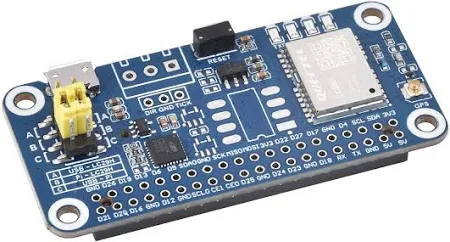
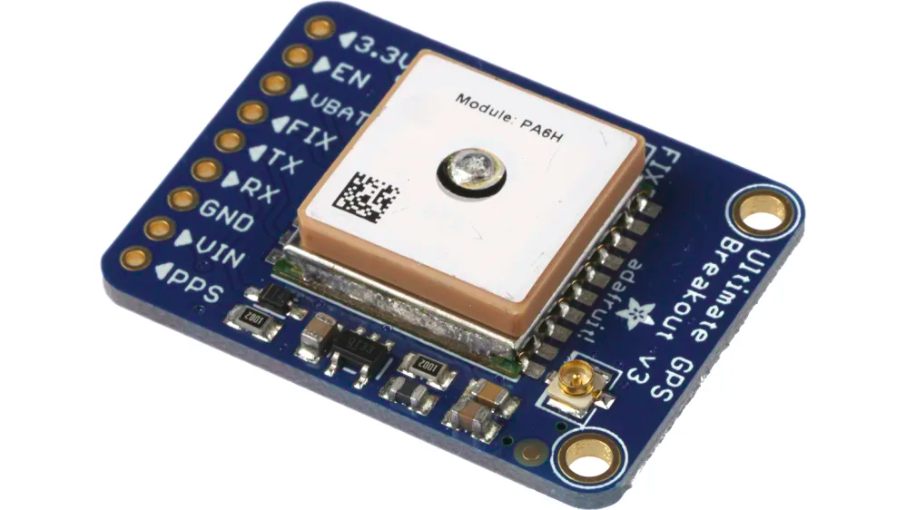

# Trailblazer GPS
Paczka ROS 2 do obsługi rzeczywistego modułu GPS (np. RTK lub zwykłego) podłączonego przez port szeregowy. Węzeł publikuje dane GPS w formacie `NavSatFix` zgodnie ze standardami ROS 2. 

## 📚 Spis treści

- [📁 Struktura katalogów](#-struktura-katalogów)
- [⚙️ Używany sprzęt](#️-używany-sprzęt)
- [📄 Opis działania](#-opis-działania)
- [🛠️ Jak używać](#️-jak-używać)
    - [✅ Zbudowanie paczki](#-zbudowanie-paczki)
    - [🚀 Uruchomienie GPS](#-uruchomienie-gps-samodzielnie)
    - [🧩 Integracja z innymi paczkami](#-integracja-z-innymi-paczkami)


## 📁 Struktura katalogów
    src/trailblazer_nav2
    ├── launch              # Plik startowy
    ├── trailblazer_gps     # Pliki gps
    |   ├── basic_gps.py    # GPS rtk
    |   └── rtk_gps.py      # GPS mały
    ├── package.xml         # Zależności, opis, wersja
    ├── setup.py            # Plik instalacyjny
    └── trailblazer_nav2    # Moduł paczki

## ⚙️ Używany sprzęt
Podczas pracy z GPS używamy:
- LC29H GPS/RTK
- nie wiem 

<div align="center">
    
    
</div>

## 📄 Opis działania
Paczka trailblazer_gps odczytuje dane z rzeczywistego modułu GPS przez port szeregowy (np. /dev/ttyUSB0) i publikuje je w formacie NavSatFix na temat `/gps/fix`. Obsługuje wiadomości NMEA $GNGGA i $GNRMC, wykorzystując bibliotekę pynmea2, by odczytać współrzędne geograficzne. W przypadku poprawnego fixa dane są publikowane w ROS 2, a launch file pozwala na łatwe uruchomienie różnych typów GPS z parametrami. Wbudowana obsługa wyjątków zapewnia stabilne działanie nawet przy błędach transmisji.

## 🛠️ Jak używać
### ✅ Zbudowanie paczki
```bash
cd ~/TrailblazerML
colcon build --packages-select trailblazer_gps
source install/setup.bash
```
### 🚀 Uruchomienie gps samodzielnie
```bash
ros2 run trailblazer_gps rtk_gps --ros-args --param port:=/dev/ttyUSB0
ros2 launch trailblazer_gps gps.launch.py port:=/dev/ttyUSB0 gps_type:=rtk_gps
```

### 🧩 Integracja z innymi paczkami
```python
gps_node = Node(
        package='trailblazer_gps',
        executable=<rtk_gps lub basic_gps>,
        name='gps_node',
        parameters=[{
            'port': <nazwa_portu>,
        }]
    )
```