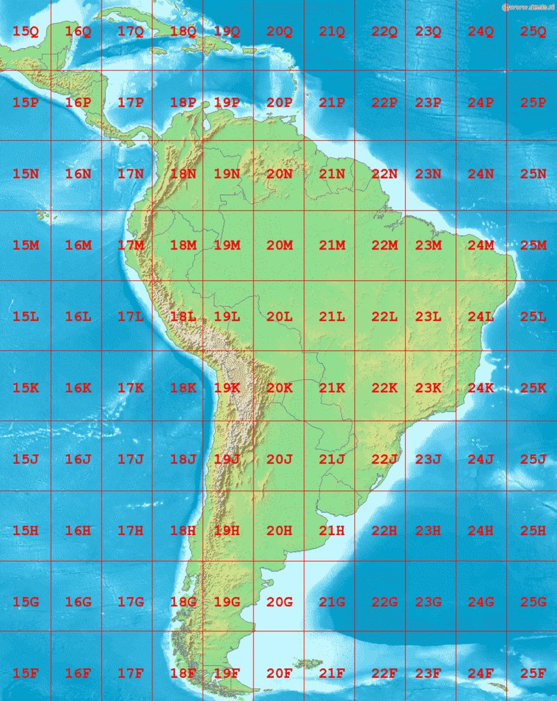

# Trailblazer nav2
Paczka trailblazer_nav2 odpowiada za autonomiczną nawigację robota Trailblazer z wykorzystaniem systemu Nav2 w ROS 2.
Zawiera konfigurację lokalizacji, nawigacji. Jej celem jest umożliwienie robotowi samodzielnego przemieszczania się po znanym terenie oraz łatwe dostosowanie ustawień do własnych map i tras.

TODO:
- [ ] Dodać gotowe przykłady mapy (maps/)
- [ ] Opisać jak dodać własne punkty GPS do jazdy

## 📚 Spis treści

- [📁 Struktura katalogów](#-struktura-katalogów)
- [🗺️ GPS i GNNS](#-gps-i-gnss)
- [🧭 Lokalizacja robota](#-lokalizacja-robota)
- [🚗 Autonomiczna jazda](#-autonomiczna-jazda)
- [👣 Co to base footprint?](#-co-to-base-footprint?)
- [🛠️ Jak używać](#️-jak-używać)

## 📁 Struktura katalogów
    src/trailblazer_nav2
    ├── config              # Pliki konfiguracyjne
    ├── launch              # Pliki startowe
    ├── maps                # Mapy
    ├── package.xml         # Zależności, opis, wersja
    ├── setup.py            # Plik instalacyjny
    └── trailblazer_nav2    # Moduł paczki

## 🗺️ GPS i GNNS
### ❔ Co to jest GPS/GNSS?
GPS/GNSS to systemy, które używają satelit, by określić Twoje położenie (szerokość, długość i wysokość geograficzną).Standardowo pozycję podaje się w układzie ***WGS84*** – to taki "globalny" system XYZ, którego środek jest w środku Ziemi.
<div align="center">
  
</div>

Nawigowanie robota w takim systemie byłoby niewygodne — lepiej mówić mu "jedź 100 metrów na północ", a nie przesuwaj się o 0.001 stopnia szerokości geograficznej.

### ❔ Co to UTM?
Aby rozwiązać ten problem, używa się systemu UTM (Universal Transverse Mercator).
UTM dzieli Ziemię na strefy i tworzy lokalne układy współrzędnych w metrach, co znacznie ułatwia nawigację dla robotów bo zamiast globalnych współrzędnych mamy lokalne X i Y w metrach.
<div align="center">
  
</div>

## 🧭 Lokalizacja robota
Robot musi wiedzieć gdzie jest i w którą stronę patrzy. GPS daje tylko pozycję, ale nie orientację (czyli "w którą stronę przód robota jest skierowany"). Rozwiązaniem tego jest zastosowanie IMU (Inertial Measurement Unit), które mierzy przyspieszenia i obroty. W skrócie:
- GPS mówi „gdzie jestem?”,
- IMU mówi „w którą stronę jestem obrócony?”.

### 📦 Konfiguracja lokalizacji
Do dokładniejszego połączenia tych danych (IMU, enkodery i GPS) używamy `filtra EKF` (Extended Kalman Filter) oraz  rzetwarzaniu danych GNSS za pomocą `navsat_transform` z pakietu [robot_localization](https://docs.ros.org/en/melodic/api/robot_localization/html/index.html).

1) `navsat_transform_node` - Przelicza dane z GPS (dane geograficzne: długość/szerokość/ wysokość) na układ współrzędnych X, Y, Z 
2) `ekf_filter_node_odom` (mały EKF) - Łączy odometrię z IMU lokalnie, żeby mieć dokładne śledzenie ruchu robota w krótkiej skali (czyli bez użycia GPS)
3) `ekf_filter_node_map` (duży EKF) - Łączy wyniki małego EKF + pozycję GPS + IMU, żeby wiedzieć gdzie robot jest globalnie na mapie.

> [!NOTE]
> Poprawny łańcuch transformacji wygląda:
> 
> map (z ekf_filter_node_map) ➡️ odom (z ekf_filter_node_odom) ➡️ base_footprint ➡️ base_link

## 🚗 Autonomiczna jazda

## 👣 Co to base footprint?

## 🛠️ Jak używać
### ✅ Zbudowanie paczki
```bash
cd ~/TrailblazerML
colcon build --packages-select trailblazer_nav2
source install/setup.bash
```
### 🚀 Uruchomienie symulacji samodzielnie
```bash

```

### 🧩 Integracja z innymi paczkami
```python

```